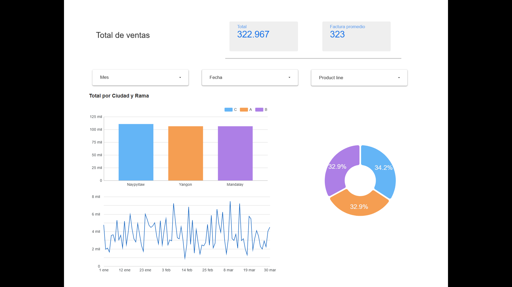
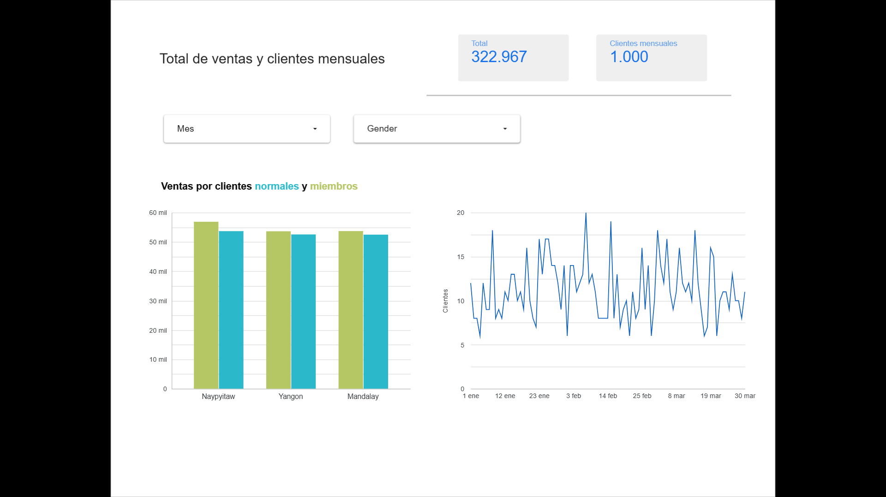
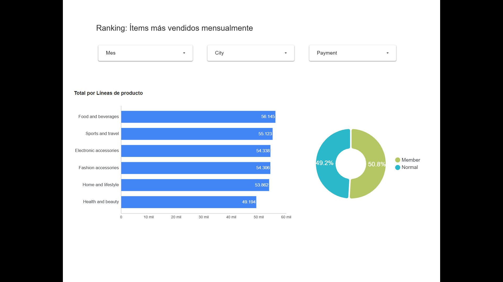
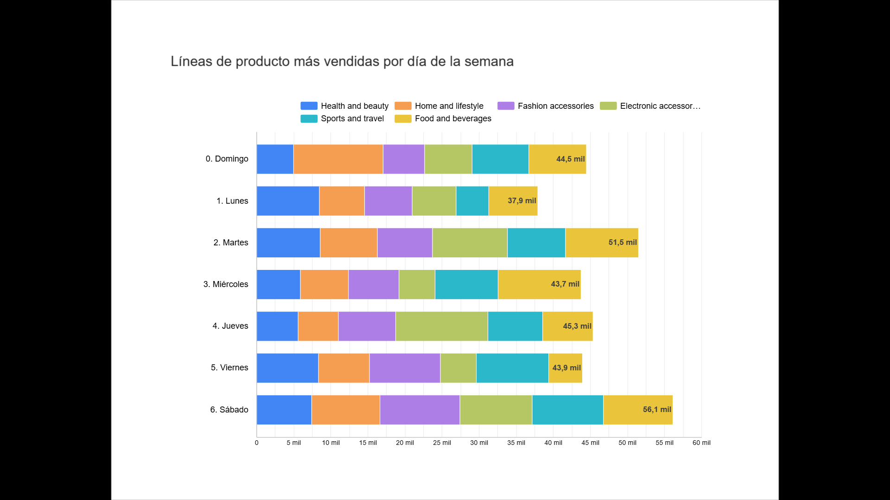
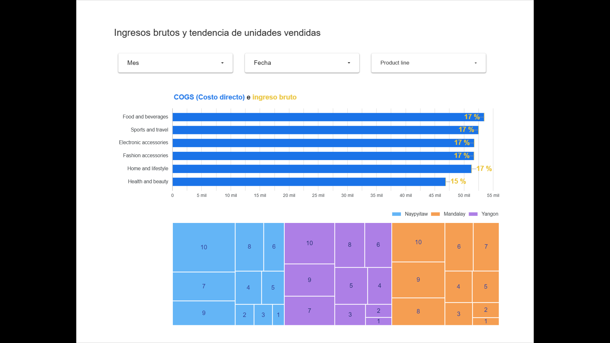

<h2>🟧 Descripción general:</h2>
 
En esta actividad se ha realizado un análisis de un set de datos de supermercado utilizando herramientas como correlación, estadística descriptiva y creación de top 5 para comprender el comportamiento de las ventas. Se agrega una serie de tableros en Looker Studio para explicar el comportamiento de algunas variables.
<h2>⚙️Tecnologías: </h2>
 
    • Python 3.10+ 
    • Jupyter Notebook 
    • Pandas 
    • Os 
    • Numpy 
    • Seaborn 
    • Matplotlib 
    • Looker Studio 
 
 
<h2>🖇️ Fuente: </h2> 

([supermarket_sales](https://www.kaggle.com/datasets/paramvir705/supermarket-sales))
  
<h2>📄 Formato: CSV</h2>
  
<h2>🧩 Variables:</h2
 
ID, Rama, Ciudad, Tipo de cliente, Género, Línea de producto, Precio unitario, Cantidad, Impuesto 5%, Total, Fecha, Hora, Pago, COGS, Margen bruto, Ingreso bruto, Rating.
  
<h2>📊 Actividades: </h2>
 
    • Estadística descriptiva básica mediante histogramas y boxplot. 
    • Filtros, agrupamientos y uso de método rank para cálculo de facturas promedio. 
    • Conversión y manejo de arrays de Numpy. 
    • Gráficos de correlación . 
    • Diseño de tablero dinámico en Looker Studio: 
    https://lookerstudio.google.com/reporting/75d18ce3-8763-4fa0-b5c9-d8ed5b7f5ec1
    
   
 
<h2>🌟 Descubrimientos generales:</h2>   
• Se observó que las mujeres adquieren más productos de Hogar y estilo de vida, mientras que los hombres adquieren más productos de Salud y belleza.   
• En promedio se adquieren de 5 a 6 productos.   
• La ciudad con más ventas es Naypyitaw.   
• Las ventas más grandes fueron hechas mayormente por clientes miembros del supermercado.   
• Las formas de pago más comunes son E-wallet y efectivo.   
• Entre más se compra, mayor es el impuesto a pagar.

  
<h2>▶️ Algunas pestañas del tablero en Looker Studio</h2> 
 

  

  

  

  

   
 
 

